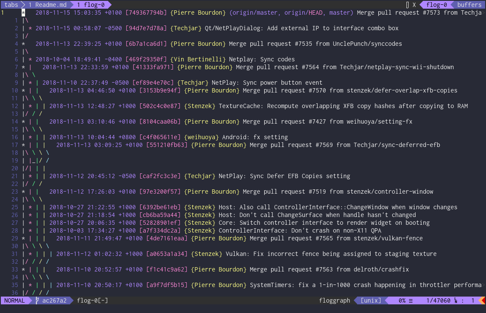

# Flog

[](https://travis-ci.org/rbong/vim-flog)

Flog is a lightweight and powerful git branch viewer that integrates with
[fugitive](https://github.com/tpope/vim-fugitive).



## Installation

Using [Plug](https://github.com/junegunn/vim-plug) add the following to your `.vimrc`:

```vim
Plug 'tpope/vim-fugitive'
Plug 'rbong/vim-flog'
```

See `:help plug-example` for more information.
If you do not use plug, see your plugin manager of choice's documentation.

Requires vim version 7.4.2204 or greater.
Neovim is also supported.

## Using Flog

Open the commit graph with `:Flog` or `:Flogsplit`.
Many options can be passed in, complete with `<Tab>` completion.

Open commits in temporary windows once you've opened Flog using `<CR>`.
Jump between commits with `<C-N>` and `<C-P>`.

Refresh the graph with `u`.
Toggle viewing all branches with `a`.
Toggle bisect mode with `gb`.
Toggle displaying no merges with `gm`.
Toggle viewing the reflog with `gr`.
Quit with `gq`.

Many of the bindings that work in fugitive in `:Gstatus` windows will work in Flog.

To see more bindings or get a refresher, press `g?`.

Run `:Git` commands in a split next to the graph using `:Floggit -p`.
Command line completion is provided to do any git command with the commits and refs under the cursor.

You can do a lot more with Flog.
Flog can be heavily customized, and comes with utility functions for defining your own commands.
See the [examples](EXAMPLES.md) for more details.

## Getting Help

If you have questions, requests, or bugs, see
[the issue tracker](https://github.com/rbong/vim-flog/issues) and `:help flog`.

Please see [fugitive](https://github.com/tpope/vim-fugitive) for help with Fugitive commands.
See `git log --help` for any problems specific to `git log`.

More info:
- [FAQ](FAQ.md)
- [Examples](EXAMPLES.md)
- [Contributing](CONTRIBUTING.md)
